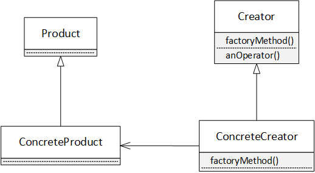

start_date:2019-5-22

## The Factory Pattern
# Baking with OO goodness

**The factory Method Pattern** defines an interface for created an object, but let subclasses decide which class to instantiate. Factory Method lets a class defer instantiation to subclasses.

PizzaStore에서 예를 들음. PizzaStore에서 abstract method를 생성. 상속받은 PizzaStore에서 abstract method를 구현하다. 이것이 factory method이다. 피자 오더의 플로우는 피자생성(create)>준비(prepare)>굽기(bake)>자르기(cut)>포장(box)와 같다.
+ 추상화1. Pizza - prepare(), bake(), cut(), box()
  - 하위 클래스가 각 method를 구현
+ 추상화2. PizzaStore - createPizza(type) : factoryMethod
  - 하위 클래스에서 Pizza의 instance를 생성
  - 다른 operator()에서 생성된 Pizza의 method를 사용

**The Abstract Factory Pattern** provides an interface for creating families of related or dependent objects without specifying their concrete classes.

(from https://en.wikipedia.org/wiki/Abstract_factory_pattern)

Pizza가 각 지역마다 재료가 다를 수 있음. 따라서 피자를 생성할때 abstract factory(여기서는 PizzaIngredientFactory)를 인자로 넘겨줌. 그럼 Pizza는 prepare()할 때, factory로 부터 재료에 대한 인스턴스를 받아옴
